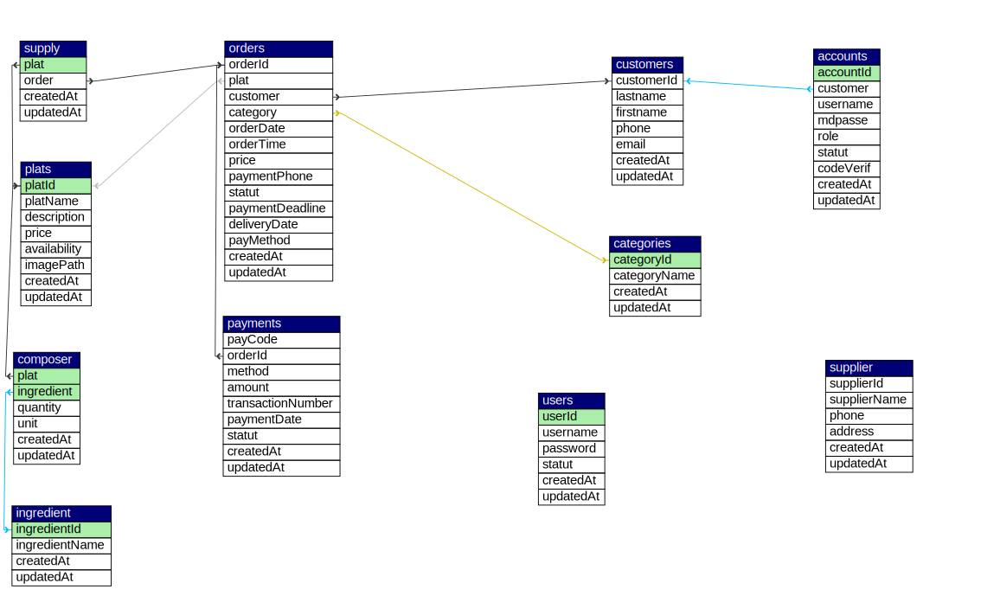

<p align="center">
  <a href="http://localhost:3000" target="blank"></a>
</p>

---

## 🍽️PeerFood Backend (NestJs)


> Une API moderne et robuste de gestion de cantine scolaire, développée en NestJS, pour permettre aux étudiants et enseignants de commander leurs repas avec un système de paiement mobile intégré.

---

## 🧭 Table des matières

- [🎯 Objectif](#-objectif)
- [🧱 Stack Technique](#-stack-technique)
- [✨ Fonctionnalités principales](#-fonctionnalités-principales)
- [📆 Planning jour par jour](#-planning-jour-par-jour-4-semaines--20-jours-de-travail)
- [🎁 Fonctionnalités bonus](#-fonctionnalités-bonus)
- [🗄️ Structure de la base de données](#️-structure-de-la-base-de-données)
- [🔍 Documentation Swagger](#-documentation-swagger)
- [⚙️ Démarrage rapide](#️-démarrage-rapide)
- [🔧 Configuration environnement (.env)](#️-configuration-environnement-env)
- [🧪 Tests](#-tests)
- [🐳 Docker (bonus)](#-docker-bonus)
- [🤝 Contribution](#-contribution)
- [📄 Licence](#-licence)

---

## 🎯 Objectif

Créer une API sécurisée, modulaire et scalable pour gérer :

- Les utilisateurs et rôles
- Le catalogue de repas
- Les commandes planifiées
- Les paiements mobiles intégrés
- Les statistiques administratives

---

## 🧱 Stack Technique

- [NestJS](https://nestjs.com/) – Framework Node.js modulaire
- [TypeORM](https://typeorm.io/) – ORM pour MySQL
- [MySQL](https://www.mysql.com/) – Base de données relationnelle
- [JWT](https://jwt.io/) – Authentification sécurisée
- [Bcrypt](https://github.com/kelektiv/node.bcrypt.js) – Hashage des mots de passe
- [Docker](https://www.docker.com/) – Conteneurisation (bonus)
- [Swagger](https://swagger.io/) – Documentation auto
- [Jest](https://jestjs.io/) – Tests unitaires
- [class-validator](https://github.com/typestack/class-validator) – Validation

---

## ✨ Fonctionnalités principales

### 👤 Utilisateurs

- Authentification JWT (login/register)
- Gestion des rôles : `Student`, `Teacher`, `Manager`, `Administrator`
- Activation/Désactivation de comptes

### 🍽️ Plats & Menu

- CRUD des plats
- Assignation d’ingrédients (composition)
- Gestion des disponibilités et prix
- Images des plats

### 🛒 Commandes

- Création de commande
- Planification & date limite
- Suivi du statut (Unpaid, Paid, Cancelled)

### 💳 Paiement Mobile

- Simulation d'intégration : MTN, Orange, Wave
- Vérification de transaction
- Statut de paiement
- Webhook (factice/test)

### 📊 Administration

- Statistiques de base (commandes, paiements)
- Gestion des utilisateurs, plats, catégories
- Documentation Swagger

---

## 📆 Planning jour par jour (4 semaines – 20 jours de travail)

| Semaines | Jours  |                       Tâches                          |
| :------: | :----: | :---------------------------------------------------: |
|          |   J1   | Init projet NestJS + Git                              |
|          |   J2   | Config TypeORM + MySQL avec `.env`                    |
|   **1**  |   J3   | Créer entités : `Customer`, `Account`, `User`         |
|          |   J4   | Créer modules/services/controllers de base            |
|          |   J5   | CRUD `Customer` + tests Postman                       |
|:--------:|:------:|:-----------------------------------------------------:|
|          |   J6   | Authentification JWT (register/login)                 |
|          |   J7   | Hashage mot de passe + validation                     |
|   **2**  |   J8   | Guards + décorateur `@Roles()`                        |
|          |   J9   | CRUD `Account` + `User`                               |
|          |   J10  | Middleware pour logging                               |
|:--------:|:------:|:-----------------------------------------------------:|
|          |   J11  | CRUD `Plat` + upload image (optionnel)                |
|          |   J12  | Entité `Commande`, relations avec `Plat` + `Customer` |
|   **3**  |   J13  | Service de création de commande                       |
|          |   J14  | Gestion du statut de commande                         |
|          |   J15  | CRUD `Ingredient`, `Composer`, `Supplier`             |
|:--------:|:------:|:-----------------------------------------------------:|
|          |   J16  | Paiement (mock) + table `Payment`                     |
|   **4**  |   J17  | Endpoints : `initiate`, `webhook`, `status`           |
|          |   J18  | Génération Swagger                                    |
|          |   J19  | Tests Jest (unitaires sur services)                   |
|          |   J20  |  Dockerisation de l'app (bonus) + README final        |

---

## 🎁 Fonctionnalités bonus

- 📤 Envoi d’e-mail/SMS à la création de commande
- 📅 Cron automatique pour annuler les commandes non payées avant deadline
- 🧾 Génération de **PDF** pour reçu de commande
- 🔔 Notifications côté gestionnaire
- 📈 Endpoint `/dashboard` pour statistiques globales

---

## 🗄️ Structure de la base de données

> 📂 Fichier : `./peerfood.sql`



---

## 🔍 Documentation Swagger

- [Documentation Swagger](URL_ADDRESS:3000/api/docs)

---

## ⚙️ Démarrage rapide

```bash
# 1. Cloner le repo
git clone https://github.com/votre-username/nest-peerfood.git
cd nest-peerfood

# 2. Installer les dépendances
npm install

# 3. Créer le fichier .env
cp .env.example .env

# 4. Lancer le projet
npm run start:dev
```

## 🗄️ Configuration environnement (.env)

```bash
# Database
DB_HOST=localhost
DB_PORT=3306
DB_USERNAME=root
DB_PASSWORD=root
DB_DATABASE=peerfood

# JWT
JWT_SECRET=secret
JWT_EXPIRATION=3600

# Mailtrap
MAILTRAP_USER=user
MAILTRAP_PASS=pass
MAILTRAP_HOST=smtp.mailtrap.io
MAILTRAP_PORT=2525
```

## 🧪 Tests

```bash
npm run test
npm run test:watch
npm run test:cov
```

## 🐳 Docker (bonus)

```bash
docker build -t nest-peerfood .
docker run -p 3000:3000 nest-peerfood
```

## 🤝 Contribution

1. Fork le projet
2. Créez votre branche (`git checkout -b feature/AmazingFeature`)
3. Commit vos changements (`git commit -m 'Add some AmazingFeature'`)
4. Push sur la branche (`git push origin feature/AmazingFeature`)
5. Ouvrez une Pull Request
🧹 Conventions : Prettier, ESLint, nommage clair, DTO typés

## 📄 Licence

MIT – Kei Prince Frejuste © 2025

<div align="center">
    <h2> Fait avec ❤️ pour nourrir intelligemment l’école en Afrique. </h2>
</div>
